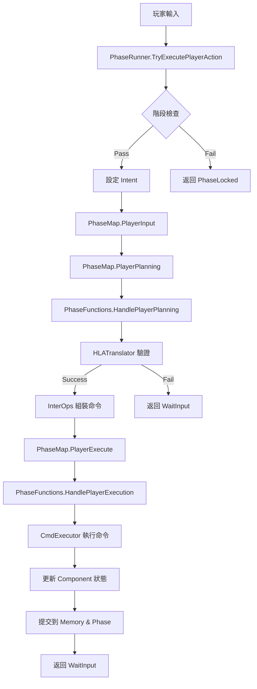
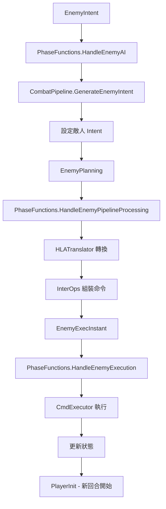

# 🏗️ Recall 專案架構說明書

**版本：** v1.0  
**日期：** 2025-08-17  
**狀態：** 生產就緒 (95% 完成)

---

## 📋 目錄
1. [Intent 到 Component 數據流](#1-intent-到-component-數據流)
2. [Combat 到 Kernel 到 Phase Function 控制流](#2-combat-到-kernel-到-phase-function-控制流)
3. [整體運作流程](#3-整體運作流程)

---

## 1. Intent 到 Component 數據流

### 🎯 設計理念
從玩家意圖到最終狀態變更的**單向數據流**設計，確保每一層職責明確且可測試。

### 📊 數據流架構圖
```
UI Input → HLAIntent → HLATranslator → InterOps → AtomicCmd → Component
   ↓           ↓            ↓            ↓          ↓          ↓
玩家操作   抽象意圖    驗證+翻譯    命令組裝   原子操作   狀態變更
```

### 🔄 詳細數據流

#### **階段 1: UI Input → HLAIntent**
```csharp
// UI 層產生高階意圖
var intent = new BasicIntent(ActionType.A, targetId: 1);  // 攻擊敵人
var recallIntent = new RecallIntent([0, 2], targetId: 1); // 回憶攻擊
```

**職責：**
- 收集玩家輸入
- 轉換為結構化意圖
- 不包含業務邏輯

#### **階段 2: HLAIntent → HLATranslator**
```csharp
// 嚴格驗證與翻譯
public FailCode TryTranslate(HLAIntent intent, PhaseContext phase, 
    RecallView memory, IActorLookup actors, Actor self,
    out BasicPlan basicPlan, out RecallPlan recallPlan)
{
    // 🔒 前置檢查
    if (!self.IsAlive) return FailCode.SelfDead;
    
    // 🔒 目標驗證
    if (intent is BasicIntent bi && bi.Act == ActionType.A)
    {
        var target = ResolveTarget(bi.TargetId, actors);
        if (target is null || ReferenceEquals(target, self))
            return FailCode.BadTarget;
    }
    
    // 🔒 資源檢查
    if (!self.HasAP(apCost)) return FailCode.NoAP;
    if (!self.HasCharge(chargeCost)) return FailCode.NoCharge;
}
```

**職責：**
- 驗證意圖合法性（目標、資源、階段）
- 計算數值（傷害、加成、消耗）
- 轉換為執行計劃（BasicPlan / RecallPlan）

#### **階段 3: Plan → InterOps → AtomicCmd[]**
```csharp
// 組裝原子命令序列
public AtomicCmd[] BuildBasic(in BasicPlan plan)
{
    var commands = new List<AtomicCmd>();
    commands.Add(AtomicCmd.ConsumeAP(plan.Source, plan.APCost));
    
    switch (plan.Act)
    {
        case ActionType.A:
            if (plan.ChargeCost > 0)
                commands.Add(AtomicCmd.ConsumeCharge(plan.Source, plan.ChargeCost));
            if (plan.Damage > 0)
                commands.Add(AtomicCmd.DealDamage(plan.Source, plan.Target, plan.Damage));
            break;
    }
    
    return commands.ToArray();
}
```

**職責：**
- 根據計劃組裝命令序列
- 處理複雜邏輯（Recall 批次操作）
- 生成可執行的原子命令

#### **階段 4: AtomicCmd → Component**
```csharp
// 原子命令執行
public int Execute()
{
    return Type switch
    {
        CmdType.DealDamage => ExecuteDealDamage(),
        CmdType.AddShield => ExecuteAddShield(),
        CmdType.GainCharge => ExecuteGainCharge(),
        CmdType.ConsumeAP => ExecuteConsumeAP(),
        _ => 0
    };
}

private int ExecuteDealDamage()
{
    // 護盾優先吸收
    int shieldAbsorbed = SelfOp.CutShield(Target, Value);
    int penetrating = Value - shieldAbsorbed;
    
    // 計算實際 HP 傷害
    if (penetrating > 0)
        return SelfOp.CutHP(Target, penetrating);
    return 0;
}
```

**職責：**
- 執行最小單位的狀態操作
- 無副作用設計（不隱式扣除資源）
- 返回實際變動量

### 🏆 設計優勢

1. **可測試性** - 每層都可以獨立測試
2. **可追溯性** - 從 Intent 到最終效果完全可追蹤
3. **錯誤處理** - 在適當層級攔截和處理錯誤
4. **擴展性** - 新增動作類型只需擴展對應層級
5. **安全性** - 多層驗證確保操作合法性

---

## 2. Combat 到 Kernel 到 Phase Function 控制流

### 🎯 設計理念
採用**狀態機驅動**的控制流設計，通過 Phase 切分實現清晰的流程控制和業務邏輯分離。

### 🏛️ 控制流架構圖
```
Combat.cs → PhaseRunner → PhaseMap → PhaseFunctions → CombatPipeline
    ↓           ↓           ↓            ↓              ↓
  UI控制     流程守護    狀態轉換    業務邏輯執行    工具方法庫
```

### 🔄 詳細控制流

#### **層級 1: Combat.cs - UI 控制層**
```csharp
public void TryRunBasic(ActionType act, int? targetId)
{
    var intent = new BasicIntent(act, targetId);
    
    // 🛡️ 通過 PhaseRunner 保護機制
    var result = PhaseRunner.TryExecutePlayerAction(ref CombatState, intent);
    
    // 刷新 UI
    RefreshAllUI();
}
```

**職責：**
- 接收 UI 事件
- 轉換為標準化調用
- 刷新 UI 狀態
- **不直接操作 PhaseContext**

#### **層級 2: PhaseRunner - 流程守護層**
```csharp
public static PhaseResult TryExecutePlayerAction(ref CombatState state, HLAIntent intent)
{
    // 🔒 階段保護
    if (!CanPlayerAct(state.PhaseCtx))
        return PhaseResult.PhaseLocked;
    
    // 🔒 重複動作保護
    if (state.PhaseCtx.HasPendingIntent)
        return PhaseResult.Pending;
    
    // ✅ 設定 Intent 並推進流程
    state.PhaseCtx.SetIntent(intent);
    return AdvanceUntilInput(ref state);
}

public static PhaseResult AdvanceUntilInput(ref CombatState state)
{
    PhaseResult result = PhaseResult.Continue;
    while (result == PhaseResult.Continue)
    {
        result = Run(ref state);
        if (IsStoppingResult(result)) break;
    }
    return result;
}
```

**職責：**
- 提供安全的公開接口
- 實施保護機制（階段、重複動作、無窮迴圈）
- 控制流程推進
- **不包含業務邏輯**

#### **層級 3: PhaseMap - 狀態轉換層**
```csharp
public static readonly Dictionary<PhaseStep, StepFunc> StepFuncs = new()
{
    // 純狀態轉換
    { PhaseStep.PlayerDraw, (ref CombatState state) => {
        UISignalHub.NotifyPlayerDrawComplete();
        state.PhaseCtx.Step = PhaseStep.PlayerInput;
        return PhaseResult.Continue;
    }},
    
    // 調用業務邏輯
    { PhaseStep.PlayerInit, (ref CombatState state) => 
        PhaseFunctions.HandlePlayerInit(ref state) },
    
    // 帶攔截點的調用
    { PhaseStep.PlayerExecute, (ref CombatState state) => {
        // 🎯 Reaction System 攔截點
        ReactionSystem.Trigger(ReactionTrigger.PlayerExecutePhase, state.PhaseCtx);
        return PhaseFunctions.HandlePlayerExecution(ref state);
    }},
};
```

**職責：**
- 定義狀態機轉換規則
- 提供 Reaction System 攔截點
- 路由到對應的業務邏輯
- **狀態轉換與業務邏輯的橋樑**

#### **層級 4: PhaseFunctions - 業務邏輯層**
```csharp
public static PhaseResult HandlePlayerExecution(ref CombatState state)
{
    // 取得轉換結果
    if (!state.PhaseCtx.TryConsumeTranslation(out var translation))
        return PhaseResult.WaitInput;
    
    // 🎯 執行前反應
    ReactionSystem.Trigger(ReactionTrigger.BeforePlayerExecution, ...);
    
    // 執行命令
    var execResult = CombatPipeline.ExecuteCommands(state, translation.Commands, ...);
    
    // 🎯 執行後反應
    ReactionSystem.Trigger(ReactionTrigger.AfterPlayerExecution, ...);
    
    // 分析結果並觸發事件
    AnalyzeAndTriggerEvents(state, translation.Commands, execResult);
    
    // 提交狀態變更
    CommitPlayerAction(state, translation.OriginalIntent, execResult);
    
    return PhaseResult.WaitInput;
}
```

**職責：**
- 實現具體業務邏輯
- 協調多個服務調用
- 管理狀態提交
- **核心業務邏輯的實現者**

#### **層級 5: CombatPipeline - 工具方法庫**
```csharp
public static TranslationResult TranslateIntent(CombatState state, Actor actor, HLAIntent intent)
{
    // 呼叫 HLATranslator 進行轉換
    var failCode = Translator.TryTranslate(...);
    if (failCode != FailCode.None)
        return TranslationResult.Fail(failCode);
    
    // 呼叫 InterOps 組裝命令
    var commands = intent switch
    {
        BasicIntent => InterOps.BuildBasic(basicPlan),
        RecallIntent => InterOps.BuildRecall(recallPlan),
        _ => Array.Empty<AtomicCmd>()
    };
    
    return TranslationResult.Pass(commands, intent);
}
```

**職責：**
- 提供純工具方法
- 協調低層服務
- **無狀態的靜態方法庫**

### 🏆 控制流優勢

1. **安全性** - 多層保護機制防止非法操作
2. **可維護性** - 每層職責明確，易於修改
3. **可擴展性** - 新增 Phase 或業務邏輯容易實現
4. **可測試性** - 每層都可以獨立測試
5. **性能** - 簡化的架構減少不必要的抽象層

---

## 3. 整體運作流程

### 🌊 完整戰鬥流程

#### **玩家回合流程**


#### **敵人回合流程**


### 🔄 典型操作範例

#### **範例 1: 玩家攻擊**
```
1. UI: 點擊 Attack 按鈕 (targetId = 1)
   ↓
2. Combat.cs: TryRunBasic(ActionType.A, 1)
   ↓
3. PhaseRunner: TryExecutePlayerAction(BasicIntent(A, 1))
   ↓ (階段檢查 Pass)
4. PhaseContext: SetIntent(BasicIntent(A, 1))
   ↓
5. PhaseMap: PlayerInput → PlayerPlanning
   ↓
6. PhaseFunctions: HandlePlayerPlanning()
   ↓
7. HLATranslator: 驗證目標、AP、計算傷害
   ↓ (驗證 Pass)
8. InterOps: 組裝 [ConsumeAP(1), DealDamage(5)]
   ↓
9. PhaseMap: PlayerPlanning → PlayerExecute
   ↓
10. PhaseFunctions: HandlePlayerExecution()
    ↓
11. CmdExecutor: 執行命令序列
    ↓
12. AtomicCmd: DealDamage → SelfOp.CutHP(enemy, 5)
    ↓
13. Component: enemy.HP.Value -= 5
    ↓
14. Memory: Push(ActionType.A, currentTurn)
    ↓
15. UI: 自動刷新顯示新的 HP 值
```

#### **範例 2: Recall 操作**
```
1. UI: 選擇記憶槽位 [0, 2] + 確認
   ↓
2. PhaseRunner: TryExecutePlayerAction(RecallIntent([0,2], 1))
   ↓
3. HLATranslator: 驗證索引、檢查目標、計算 Charge 消耗
   ↓
4. InterOps: 組裝批次命令 [ConsumeAP(1), DealDamage(5), AddShield(6)]
   ↓
5. CmdExecutor: 批次執行所有命令
   ↓
6. PhaseContext: MarkRecallUsed() (本回合限制)
```

### 🛡️ 錯誤處理流程

#### **驗證失敗處理**
```
1. HLATranslator: 發現 FailCode.NoAP
   ↓
2. PhaseFunctions: 返回 PhaseResult.WaitInput
   ↓
3. PhaseMap: PlayerPlanning → PlayerInput
   ↓
4. PhaseRunner: 返回 PhaseResult.WaitInput
   ↓
5. Combat.cs: 可選擇顯示錯誤訊息給玩家
```

#### **階段保護機制**
```
1. PhaseRunner: CanPlayerAct() 檢查失敗
   ↓
2. 直接返回 PhaseResult.PhaseLocked
   ↓
3. Combat.cs: 忽略玩家輸入 (無任何狀態變更)
```

### ⚡ 性能特點

1. **最小化狀態拷貝** - 使用 `ref CombatState` 避免不必要的拷貝
2. **延遲計算** - 只在需要時才進行複雜計算
3. **批次執行** - CmdExecutor 支援批次操作減少開銷
4. **短路優化** - 護盾吸收等邏輯有早期返回
5. **字典查找優化** - PhaseMap 使用高效的字典查找

### 🎯 擴展點

1. **新增動作類型** - 在 ActionType, HLATranslator, InterOps 中擴展
2. **新增 Phase** - 在 PhaseStep, PhaseMap, PhaseFunctions 中新增
3. **Reaction System** - 在現有攔截點註冊新的反應
4. **AI 策略** - 在 CombatPipeline.GenerateEnemyIntent 中實現
5. **UI 功能** - 在 Combat.cs 中新增方法並連接到 PhaseRunner

---

## 🏆 架構總結

Recall 專案採用**分層架構 + 狀態機驅動**的設計，實現了：

### ✅ 核心優勢
- **職責分離** - 每層專注自己的職責
- **安全可靠** - 多層保護機制防止錯誤
- **易於測試** - 每個組件都可獨立測試  
- **高性能** - 最少的抽象層和優化的數據流
- **易擴展** - 清晰的擴展點支援新功能

### 🎯 設計哲學
- **單向數據流** - 從 Intent 到 Component 的清晰路徑
- **最小複雜度** - 避免過度設計，保持簡潔
- **信任鏈模式** - 上層驗證，下層執行
- **無副作用** - 每個操作都是明確和可預測的

這個架構為 Recall 專案提供了堅實的基礎，支援當前的戰鬥系統並為未來的 Echo、卡牌系統等功能提供了良好的擴展性。